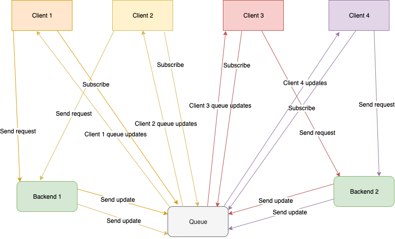
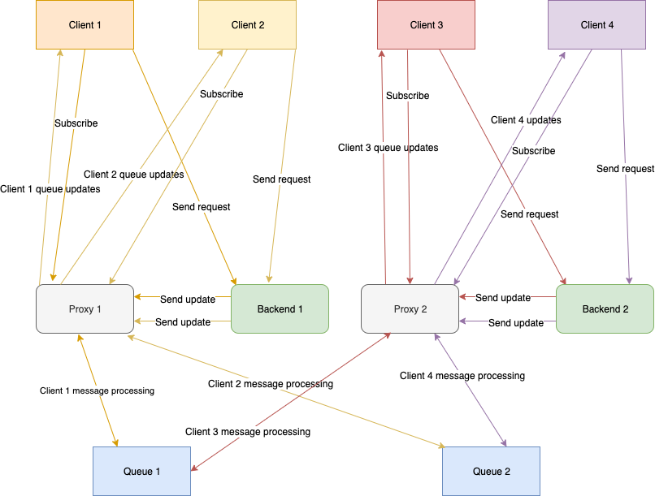

<h1 align="center">Welcome to SonyaWQ 👋</h1>

  
  

> **SonyaWQ** is a fast, distributed queue that provides a flexible realization of the `Web Queue` in [Web Queue Worker](https://principles.green/principles/applied/web-queue-worker/) architecture.
> **SonyaWQ** realize Service Mesh architecture with service discovery support.

> The Web-Queue-Worker architecture defines a web portion that handles HTTP requests and a worker portion that handles time or processing-intensive operations. A queue is used for asynchronous communication between the web and the worker.

## Top use cases
### Heavy requests
Move your long time and heavy tasks to backend workers. 
When it's processed notify clients with **SonyaWQ**. 

### Broadcast updates between clients
Notify clients about any changes on every device.

### Add more interactive
Add interactive for your clients. Chat rooms, text editing, playing in chess and etc.

## Features
### Flexible configuring
**SonyaWQ** supports simple and flexible configuring.
> You don't need to use any configurations to up the simple service

#### [Configure documentation](./documentation/configure.md)

### Simple API
**SonyaWQ** has a simple API that can be used from websites frontend, backends, and other services.

#### [API documentation](./documentation/api.md)

### Distribution
**SonyaWQ** supports `service mesh` architecture.

#### [Sharding documentation](./documentation/sharding.md)

### Request tokens protection
**SonyaWQ** provides the `JWT` and `Service Token` requests protection support.
#### [Tokens documentation](./documentation/secure.md)

## Architectures visualization

### One queue
> All clients and backends will use only one queue.
> Good solutions for small projects.

### Service Mesh
> With proxies will automatically distribute queues messages between some queues. 
> The best solution for increasing your scalability.

## Author

👤 **Mikhail Panfilov**

* Github: [@Mnwa](https://github.com/Mnwa)
* LinkedIn: [@https:\/\/www.linkedin.com\/in\/mikhail-panfilov-020615133\/](https://linkedin.com/in/https:\/\/www.linkedin.com\/in\/mikhail-panfilov-020615133\/)

## 🤝 Contributing

Contributions, issues, and feature requests are welcome! Feel free to check [issues page](https://github.com/Mnwa/sonya/issues).

## Show your support

Give a ⭐️ if this project helped you!