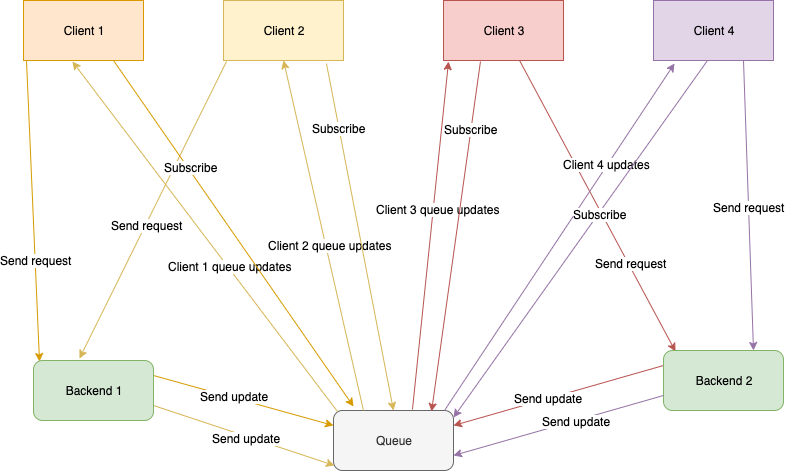
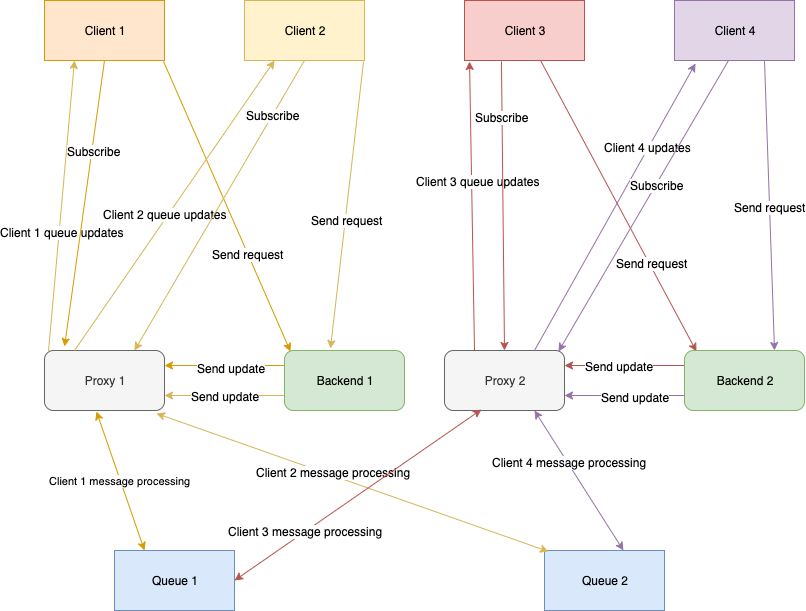

# Queues and Proxies

SonyaWQ provides two option of setup.

### Queue only

This is a simple schema. You had only one queue which works with all your clients and backends.

#### Visualize

### Service Mesh
> In software architecture, a service mesh is a dedicated infrastructure
> layer for facilitating service-to-service communications between 
> services or microservices, using a proxy.

This is the most useful way to create distributed and scalable solutions.

SonyaWQ cluster will consist of two parts:
* `Queue`. Many instances of queues from the first schema, but messages of every queue will distribute between every queue instance.
* `Proxy`. Proxy instances will be automatically distributing messages between queues.
  The proxy uses the `Maglev` consistent hashing algorithm for routing messages.

#### Service discovery
Every proxy must know about all available queue shards in your cluster.

SonyaWQ provides two ways of this knowledge:
* [Api](./api/service_discovery.md)
* [Etcd](./configure.md)

> Best practice having local small `proxies` for every backend service, which works with `queue`.

#### Visualize

#### Setup
> How to set up and configure proxies and queues 
> you can read [here](./configure.md)